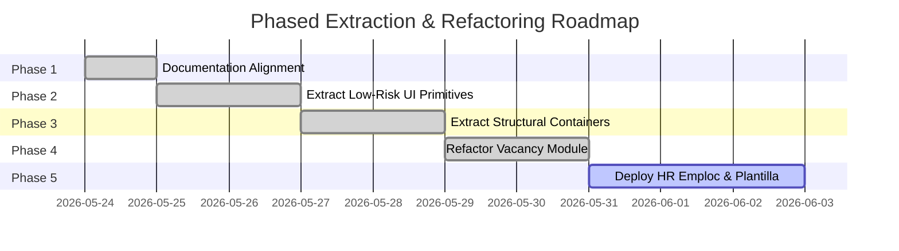

# Shared Web UI System State

## Core Purpose
This document tracks the OHMployee Web shared UI architecture, visual standards, and component extraction plan. It serves as the design system governance model for extracting consistent, desktop-first administrative UI components across current and future HR modules (Vacancy, HR Emploc, Plantilla, Approvals, etc.).

By centralizing these patterns, the codebase establishes design consistency, eliminates styling duplication, and strictly preserves the thin-client architecture where Supabase remains the sole authority for business logic, RBAC scopes, and RLS integrity.

---

## 1. Current Vacancy UI Pattern Audit

An audit of `src/app/(dashboard)/vacancy/page.tsx`, `src/components/vacancy/VacancyTable.tsx`, and `src/components/vacancy/VacancyDetailDrawer.tsx` reveals several highly mature visual patterns that currently exist as ad-hoc, module-specific structures.

### KPI Cards
- **Observed Structure**: A grid container (`grid gap-2 sm:grid-cols-2 xl:grid-cols-4`) displaying four metrics (`Open Vacancies`, `With Applicant`, `Pending Review`, `Aging Watch`).
- **Styling**: Card wraps use `rounded-md border border-gray-200 bg-white px-3 py-2.5`.
- **Aesthetic Attributes**: Subdued gray uppercase label (`text-xs font-medium uppercase text-gray-500`), prominent value display (`text-2xl font-semibold text-gray-900`) with loading state fallback (`--`), and helper subtitle text (`text-xs text-gray-400`).
- **Data Source**: Integrated directly with `get_web_vacancy_summary(...)` with a hardcoded `Badge` showing either "RPC" or "Blocked" based on security checks.

### Dense Table
- **Observed Structure**: A highly compact tabular viewport with horizontal scrolling (`min-w-[1060px] border-separate border-spacing-0`).
- **Styling**: Sticky header wrapper (`sticky top-0 z-10 bg-gray-50 text-xs font-semibold uppercase text-gray-500`), fine grey horizontal border rules (`border-b border-gray-100`), monospaced badges for technical codes (VCode), and compact action buttons (`Eye` icons inside `h-8 w-8 hover:bg-white` triggers).
- **Density**: Compact padding (`px-3 py-2`) allows scanning 25+ records on a single screen without layout fatigue.
- **Row Interaction**: Row-click triggers side-selection (`cursor-pointer hover:bg-gray-50`), highlighting selected items in soft blue (`bg-blue-50`). Includes `cursor-not-allowed` fallback when capability checks restrict item details.

### Filter Toolbar
- **Observed Structure**: A flexible search-and-filter toolbar container (`flex flex-wrap items-center gap-2 rounded-md border border-gray-200 bg-white p-2`).
- **Styling**: Icon-prefix search bar (`relative min-w-[280px] flex-1` with Lucide `Search` in grey `absolute left-3`), standard native `<select>` dropdown overrides (`h-9 rounded-md border border-gray-200 bg-white px-3 text-sm text-gray-600`), and dual action triggers ("Apply" and "Saved View" placeholder button).

### Status & Urgency Badges
- **Observed Structure**: Dynamic inline status pills displaying primary traits.
- **Styling**: Rounded borders with soft backgrounds (`border-blue-200 bg-blue-50 text-blue-700` for general statuses; `border-purple-200 bg-purple-50 text-purple-700` for candidate activity; `border-red-200 bg-red-50 text-red-700` for SLA breaches or high urgency; `border-amber-200 bg-amber-50 text-amber-700` for warning/medium urgency).

### Detail Drawer
- **Observed Structure**: A desktop-first command-center layout sliding over the active table from the right.
- **Styling**: Translucent overlay backdrop (`fixed inset-0 z-40 bg-black/40 backdrop-blur-xs`) paired with an absolute aside drawer (`fixed top-0 right-0 z-50 flex h-full w-[460px] border-l bg-white shadow-2xl`).
- **Keyboard Handling**: Actively listens to `Escape` key events at the window boundary to dismiss selections cleanly.
- **Structural Layout**: Rigid block layout with compact headers, icon-labeled parameters (e.g. MapPin, Calendar, User), SLA alert warning containers, PII-shielded candidate summaries, approvals context tables, and vertical audit timeline lists.

### Blocked & Error States
- **Observed Structure**: Highly expressive, centralized error handling.
- **Access Denied**: Displays a shield icon (`rounded-full bg-red-50 p-3 text-red-600`) with text indicating RLS access blocked ("Supabase RLS policies blocked this detail read. You are not authorized...").
- **Network / RPC Failure**: Displays an warning card (`rounded-full bg-amber-50 p-3 text-amber-600`) with custom messages and a prominent "Retry Query" call-to-action button.

### Loading Skeletons
- **Observed Structure**: Section-specific pulsing containers that match target content blocks.
- **Table Loader**: Simple centralized spinner (`RefreshCw className="animate-spin"`) matching table boundaries to maintain shell layout.
- **Drawer Loader**: Segmented pulsing bars (`LoadingSkeleton` with multi-tier `bg-gray-100 rounded` rectangles) mimicking summary blocks, details, and cards to prevent cumulative layout shift (CLS).

### Action Placeholders
- **Observed Structure**: A dynamic container displaying administrative actions backed by client presentation checks.
- **Styling**: Full-width bordered cards with inline state badges (`border-green-200 bg-green-50 text-green-700` showing "available" vs. `border-gray-200 bg-gray-100 text-gray-500` for "not exposed" hints).

---

## 2. Reusable Shared Component Specifications

To enforce consistency across the admin workspace, these audited UI patterns will be extracted into a central suite of reusable components under `src/components/ui/` or `src/components/shared/`.

```mermaid
graph TD
    subgraph Shared UI Layer
        H[AdminPageHeader]
        MC[MetricCard]
        FB[AdminFilterBar]
        DS[DataState]
        SB[StatusBadge]
        AB[CapabilityActionBar]
        DD[DetailDrawer]
        AT[AdminDataTable]
    end
    subgraph Feature Modules
        V[Vacancy Module] --> Shared UI Layer
        HE[HR Emploc Module] --> Shared UI Layer
        P[Plantilla Module] --> Shared UI Layer
    end
```

### `AdminPageHeader`
- **Location**: `src/components/shared/AdminPageHeader.tsx`
- **Props**:
  ```typescript
  interface AdminPageHeaderProps {
    title: string;
    subtitle?: string;
    icon?: React.ComponentType<{ className?: string }>;
    readOnly?: boolean;
    primaryAction?: {
      label: string;
      onClick: () => void;
      disabled?: boolean;
      icon?: React.ComponentType<{ className?: string }>;
    };
  }
  ```
- **Behavior**: Standardizes page headings with optional Lucide icon matching, "Read only" environment badge triggers, and administrative action alignment.

### `MetricCard`
- **Location**: `src/components/shared/MetricCard.tsx`
- **Props**:
  ```typescript
  interface MetricCardProps {
    label: string;
    value: string | number | undefined;
    helperText?: string;
    isLoading?: boolean;
    isBlocked?: boolean;
    badgeLabel?: string;
  }
  ```
- **Behavior**: Renders metric states cleanly, handling blank loading signs (`--`) and presenting standard metadata states ("RPC", "Blocked").

### `AdminFilterBar`
- **Location**: `src/components/shared/AdminFilterBar.tsx`
- **Props**:
  ```typescript
  interface FilterOption {
    value: string;
    label: string;
  }
  interface FilterSelect {
    key: string;
    label: string;
    options: FilterOption[];
    value: string;
    onChange: (value: string) => void;
  }
  interface AdminFilterBarProps {
    searchPlaceholder: string;
    searchVal: string;
    onSearchChange: (val: string) => void;
    onSearchSubmit: (e: React.FormEvent<HTMLFormElement>) => void;
    selects: FilterSelect[];
    onApply: () => void;
    disabled?: boolean;
  }
  ```
- **Behavior**: Provides a unified, wrap-ready form boundary. Abstracts native select triggers and standardizes the placement of filters and actions.

### `DataState`
- **Location**: `src/components/shared/DataState.tsx`
- **Props**:
  ```typescript
  type StateKind = "loading" | "empty" | "access_denied" | "error";
  interface DataStateProps {
    kind: StateKind;
    title?: string;
    description?: string;
    onRetry?: () => void;
  }
  ```
- **Behavior**: Centralizes the presentation of data lifecycle boundaries. Standardizes the lock shields for RLS blocks, alerts for network failures, spinner animations for loads, and clipboards for empty records.

### `StatusBadge`
- **Location**: `src/components/ui/StatusBadge.tsx` (extends or replaces custom badge)
- **Props**:
  ```typescript
  type BadgeVariant = "info" | "success" | "warning" | "danger" | "neutral";
  interface StatusBadgeProps {
    text: string;
    variant: BadgeVariant;
    className?: string;
  }
  ```
- **Behavior**: Standardizes semantic coloring. Translates raw DB strings into a consistent theme, avoiding ad-hoc styling.

### `CapabilityActionBar`
- **Location**: `src/components/shared/CapabilityActionBar.tsx`
- **Props**:
  ```typescript
  interface ActionItem {
    label: string;
    isAvailable: boolean;
    onClick: () => void;
  }
  interface CapabilityActionBarProps {
    actions: ActionItem[];
    helperText?: string;
  }
  ```
- **Behavior**: Encapsulates rows of disabled/interactive capabilities. Visualizes permission matrices consistently.

### `DetailDrawer`
- **Location**: `src/components/shared/DetailDrawer.tsx`
- **Props**:
  ```typescript
  interface DetailDrawerProps {
    isOpen: boolean;
    onClose: () => void;
    title: string;
    subtitle?: string;
    badge?: React.ReactNode;
    children: React.ReactNode;
  }
  ```
- **Behavior**: Captures `Escape` key signals at the document window, maps responsive mobile/desktop panel widths (defaulting to `w-[460px]`), renders overlays, and locks scrolling when active.

### `AdminDataTable` (Future Extraction)
- **Location**: `src/components/shared/AdminDataTable.tsx`
- **Props**: Takes headers, loading indicators, customizable row render callbacks, paginator parameters, and selection states.
- **Security Check**: This component will remain inline under specific modules until column arrays are proven safe from out-of-scope metadata exposure. When extracted, it must accept raw row callbacks rather than generic keys to prevent accidental PII printing.

---

## 3. Visual & Design System Rules

To maintain high-fidelity visual aesthetics (premium dashboard layouts), all extracted and refactored components must respect the following unified tokens:

### Spacing & Layout Tokens
- **Page Container Padding**: `p-4 sm:p-5 flex flex-col gap-4`
- **Metric Grids**: `grid gap-2 sm:grid-cols-2 xl:grid-cols-4`
- **Panel Insets**: `p-4` or `p-5` for high-importance read areas; `p-2.5` for mini metadata boxes.
- **Border Spacing**: Standard thin grey divisions (`border-b border-gray-100` inside drawers; `border-b border-gray-200` for major sections).

### Typography Hierarchy
- **Module Title**: `text-xl font-semibold tracking-normal text-gray-900`
- **Section Headers**: `text-sm font-semibold text-gray-900`
- **Upper Meta labels**: `text-xs font-semibold uppercase tracking-wider text-gray-400`
- **Mini metadata**: `text-[10px] font-medium uppercase text-gray-400`
- **Monospace tags**: `font-mono text-xs text-gray-700` for system codes, VCodes, IDs, and SLA buckets.

### Badge Variant Mapping
- **Success / Interactive (`success`)**: `border-green-200 bg-green-50 text-green-700` (e.g. Open statuses, available actions)
- **Warning / Medium Priority (`warning`)**: `border-amber-200 bg-amber-50 text-amber-700` (e.g. Pipeline status, Medium urgency)
- **Alert / Penalty Risk (`danger`)**: `border-red-200 bg-red-50 text-red-700` (e.g. High urgency, SLA Warnings, Blocked states)
- **Primary Operational (`info`)**: `border-blue-200 bg-blue-50 text-blue-700` (e.g. Current status cues)
- **Neutral Context (`neutral`)**: `border-gray-200 bg-gray-50 text-gray-500` (e.g. Normal Urgency, Unavailable parameters)

### Table Density & Behavior
- **Column Padding**: Cell contents must use compact sizes (`px-3 py-2`).
- **Interactive Rows**: Interactive lines must use `transition-colors hover:bg-gray-50 cursor-pointer`.
- **Row Select Color**: Highlighting active rows must strictly use `bg-blue-50` to match the dashboard sidebar styles.

---

## 4. Module-Specific Boundaries

To avoid over-abstracting the shared codebase, specific attributes must remain encapsulated *within* their parent feature modules rather than entering the shared UI library:

| Specific Attribute | Location | Why It Must Remain Module-Specific |
| --- | --- | --- |
| **Column Definitions** | `src/components/vacancy/VacancyTable.tsx` | Vacancy-specific columns (`VCode`, `Position`, `Aging`) carry no operational meaning in `Plantilla` or `HR Emploc`. |
| **Status Mapping Logic** | `src/components/vacancy/VacancyTable.tsx` | Translating statuses like `open` or `backout` into display text is unique to vacancy lifecycles. |
| **RPC Query Bindings** | `src/lib/queries/vacancy.ts` | Shared components must not invoke domain-specific queries (`list_web_vacancies`, `get_web_vacancy_detail`). |
| **Candidate / PII Formats** | `src/components/vacancy/VacancyDetailDrawer.tsx` | The structured candidate sub-listing and matching PII guard rails are specific to recruiters. |
| **Audit Log Event Mapping** | `src/components/vacancy/VacancyDetailDrawer.tsx` | Unique audit events (`Vacancy Created`, `HRCO Assigned`) carry domain-specific context. |

---

## 5. Phased Extraction & Refactoring Plan



### Phase 1: Documentation (Completed)
- Author architectural state documents and align all handoff parameters.
- Obtain formal design review approval from the developer/user context.

### Phase 2: Low-Risk Primitives Extraction (Completed)
- Create safe base files: `src/components/shared/AdminPageHeader.tsx`, `src/components/shared/MetricCard.tsx`, `src/components/shared/DataState.tsx`, and `src/components/ui/StatusBadge.tsx`.
- Keep dependencies simple: only import Lucide icons, Tailwind classes, and native components.
- Do not modify vacancy features yet. Run build tests to verify no regressions occur in static layouts.

### Phase 3: Structural Layouts Extraction (Completed)
- Create structural components: `src/components/shared/DetailDrawer.tsx`, `src/components/shared/AdminFilterBar.tsx`, and `src/components/shared/CapabilityActionBar.tsx`.
- Implement full overlay animations, window boundary ESC event handlers, and robust keyboard focus captures inside the shared drawer.

### Phase 4: Refactor Vacancy Module (Completed)
- Update `src/app/(dashboard)/vacancy/page.tsx` and `src/components/vacancy/VacancyDetailDrawer.tsx` to consume the extracted shared library.
- Verify that table row selections, loading skeletons, retry triggers, and access-denied RLS shields preserve their original behavior perfectly.

### Phase 5: Reusability Proving
- Scaffold `HR Emploc` and `Plantilla` routes.
- Replace basic module empty states (`src/components/ModuleEmptyState.tsx`) with high-fidelity, shared-component shells containing custom headers, metrics, and filter boundaries.

---

## 6. Exact Next Implementation Prompt

```markdown
ID: OHM2026_1087-IMPL-1

Task: Refactor the Vacancy module pages and components to consume the newly extracted Shared Web UI Primitives and Structural Containers.

Read only:
- docs/state/web_ui_system_state.md
- docs/state/vacancy_web_state.md
- src/components/shared/AdminPageHeader.tsx
- src/components/shared/MetricCard.tsx
- src/components/shared/DataState.tsx
- src/components/ui/StatusBadge.tsx
- src/components/shared/DetailDrawer.tsx
- src/components/shared/AdminFilterBar.tsx
- src/components/shared/CapabilityActionBar.tsx

Tasks:
1. Refactor `src/app/(dashboard)/vacancy/page.tsx` to consume:
   - `AdminPageHeader` from `src/components/shared/AdminPageHeader` for the page header.
   - `MetricCard` from `src/components/shared/MetricCard` for the upper KPI summary blocks.
   - `AdminFilterBar` from `src/components/shared/AdminFilterBar` for the search toolbar, placing the status tab selector above/beside it and the native dropdown filters inside it.
2. Refactor `src/components/vacancy/VacancyDetailDrawer.tsx` to consume:
   - `DetailDrawer` from `src/components/shared/DetailDrawer` for the slide-in layout, ESC handling, backdrop click, and scroll locking behaviors.
   - `CapabilityActionBar` from `src/components/shared/CapabilityActionBar` for rendering the action permissions and availability cues in the lower drawer.
3. Keep all candidate PII shielding, approved RPC bindings (`get_web_vacancy_detail`, `list_web_vacancies`, `get_web_vacancy_summary`), loading skeletons, access-denied RLS shields, error states, and history timelines exactly identical to their current operational state.
4. Ensure zero visual or functional regression across any Vacancy module layouts or behaviors.

Constraints:
- Preserve all existing tailwind colors, layouts, and desktop-first widths.
- Ensure strict Type and Import validation.
- Do not add any new third-party design packages.

Validation:
- Run `pnpm lint` and `pnpm build` to verify there are no compilation warnings, static export regressions, or TypeScript compilation issues.
```

